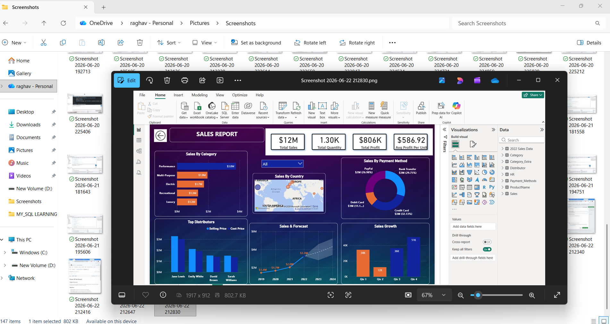
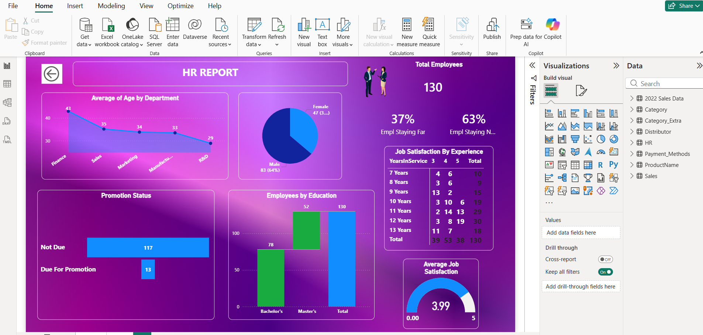

# Power BI Dashboard

## Project Overview
An end-to-end Sales Analytics Dashboard built using Microsoft Power BI, covering the complete BI workflow from raw data to interactive visualizations.

## Workflow
- **Data Discovery** – Explored and understood the sales dataset
- **Data Import** – Connected and loaded data into Power BI Desktop
- **Data Transformation** – Cleaned and shaped data using Power Query
- **Data Modeling** – Built relationships and structured data for analysis
- **DAX** – Created calculated columns and measures for dynamic insights
- **Visualizations & Reports** – Designed 10+ interactive charts and reports
- **Publishing** – Published the dashboard using Power BI Service

## Tools & Technologies
- Microsoft Power BI Desktop
- Power Query (M Language)
- DAX (Data Analysis Expressions)
- Power BI Service (Cloud)

## Key Features
- Interactive and dynamic sales dashboard
- Multiple visualizations including bar charts, line graphs, cards, matrix and gauge visuals
- End-to-end project from data import to cloud publishing

- ## Dashboard Preview

